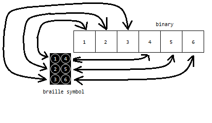

# Braille Binary Converter

A converter for braille binary. Made it because this online converter has gone down: http://tyleregeto.com/article/braille-6bit-binary-language

Uses a lookup table to convert between binary, ascii, hex and braille glyphs. Only outputs capital letters though.

### Example

	$ python3
	
	>>> from braille import *

	>>> convert('hello world!', TYPE_ASCII, TYPE_BINARY, sep=' ')
	'110010 100010 111000 111000 101010 000000 010111 101010 111010 111000 100110 011101'

	>>> x = '110010 100010 111000 111000 101010 000000 010111 101010 111010 111000 100110 011101'.split(' ')
	>>> convert(x, TYPE_BINARY, TYPE_BRAILLE)
	'⠓⠑⠇⠇⠕⠀⠺⠕⠗⠇⠙⠮'

	>>> x = '⠓⠑⠇⠇⠕⠀⠺⠕⠗⠇⠙⠮'
	>>> convert(x, TYPE_BRAILLE, TYPE_HEX)
	'48454C4C4F20574F524C4421'

	>>> x = '48454C4C4F20574F524C4421'
	>>> bytes.fromhex(x).decode()
	'HELLO WORLD!'